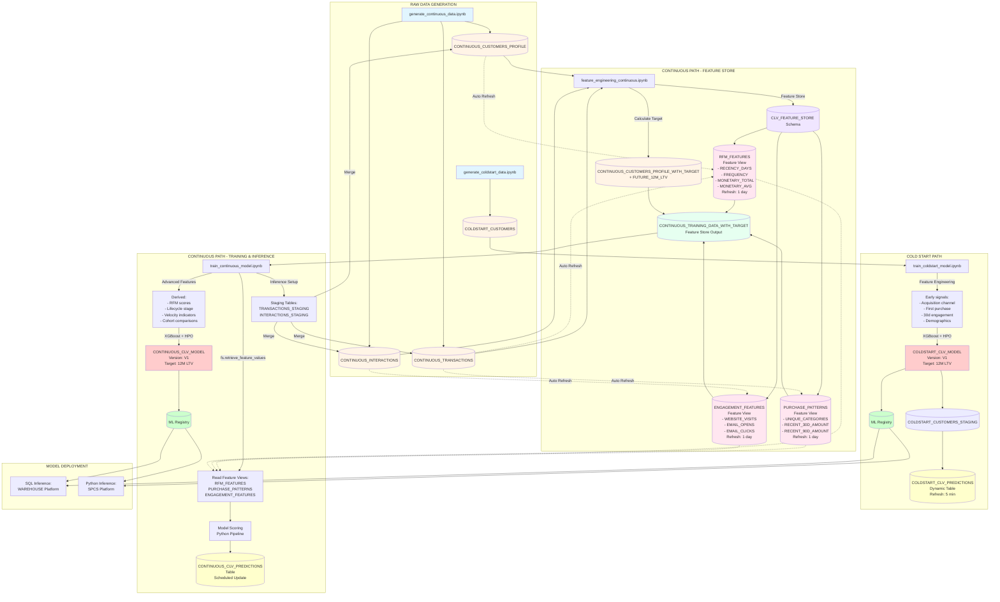

# Customer Lifetime Value ML Pipeline - Data Flow

## Data Flow Summary

### Cold Start Pipeline
**Purpose**: Predict CLV for new customers (0-30 days)

1. **Data Generation** (`generate_coldstart_data.ipynb`)
   - Input: Configuration parameters
   - Output: `COLDSTART_CUSTOMERS` (50K records)
   - Features: Demographics, acquisition, early engagement

2. **Model Training** (`train_coldstart_model.ipynb`)
   - Input: `COLDSTART_CUSTOMERS`
   - Transformations:
     - Binary indicators (first purchase)
     - Channel quality scoring
     - Engagement composite scores
     - Engagement rates
   - Output: `COLDSTART_CLV_MODEL` (Snowflake ML Registry)
   - Metrics: RMSE, MAE, R², MAPE
   - HPO: 20 trials, Bayesian optimization

3. **Inference** (Dynamic Table)
   - Staging: `COLDSTART_CUSTOMERS_STAGING`
   - Predictions: `COLDSTART_CLV_PREDICTIONS`
   - Refresh: Every 5 minutes

---

### Continuous Pipeline
**Purpose**: Predict CLV for established customers (90+ days)

1. **Data Generation** (`generate_continuous_data.ipynb`)
   - Input: Configuration parameters
   - Outputs:
     - `CONTINUOUS_CUSTOMERS_PROFILE` (50K customers)
     - `CONTINUOUS_TRANSACTIONS` (~500K transactions)
     - `CONTINUOUS_INTERACTIONS` (~5M interactions)
   - Vectorized generation for performance

2. **Feature Engineering** (`feature_engineering_continuous.ipynb`)
   - Input: Raw tables (customers, transactions, interactions)
   - **Feature Store Architecture**:
     - Schema: `CLV_FEATURE_STORE`
     - Entity: `CUSTOMER` (join key: CUSTOMER_ID)
   - **Feature Views** (Dynamic Tables, 1-day refresh):
     - `RFM_FEATURES`: Recency, Frequency, Monetary, Tenure
     - `PURCHASE_PATTERNS`: Category diversity, 30d/90d windows
     - `ENGAGEMENT_FEATURES`: Website, email, support metrics
   - Transformations:
     - Aggregate transactions by customer
     - Calculate time windows (30d, 90d)
     - Compute engagement rates
     - Join multiple data sources
   - Target Creation: `FUTURE_12M_LTV` (synthetic formula)
   - Output: `CONTINUOUS_TRAINING_DATA_WITH_TARGET`

3. **Model Training** (`train_continuous_model.ipynb`)
   - Input: `CONTINUOUS_TRAINING_DATA_WITH_TARGET`
   - Additional Transformations:
     - RFM score normalization (quintiles)
     - Lifecycle stage classification
     - Velocity indicators (30d vs 90d trends)
     - Cohort-based benchmarking
     - Engagement ratios
   - Output: `CONTINUOUS_CLV_MODEL` (Snowflake ML Registry)
   - Metrics: RMSE, MAE, R², MAPE
   - HPO: 20 trials, Bayesian optimization

4. **Inference** (Feature Store Integration)
   - Staging tables for new data:
     - `CONTINUOUS_TRANSACTIONS_STAGING`
     - `CONTINUOUS_INTERACTIONS_STAGING`
   - New data merged into base tables → Feature views auto-refresh (1 day)
   - Inference via `fs.retrieve_feature_values()` using **same** feature views as training:
     - `RFM_FEATURES` (v1.0)
     - `PURCHASE_PATTERNS` (v1.0)
     - `ENGAGEMENT_FEATURES` (v1.0)
   - Model scoring in Python with full pipeline
   - Output: `CONTINUOUS_CLV_PREDICTIONS` table
   - **Key benefit**: Zero training-serving skew - identical feature logic

---

## Key Transformations

### Feature Store Pattern
- **Raw Data → Feature Views**: Automated aggregations with scheduled refresh
- **Point-in-Time Correctness**: Features aligned with observation dates
- **Lineage Tracking**: Automatic documentation of feature derivations
- **Reusability**: Same features for training and inference

### Model Training Pattern
- **Temporal Splits**: 70% train / 15% validation / 15% test
- **Preprocessing Pipeline**: StandardScaler + OneHotEncoder
- **HPO**: Bayesian optimization with 20 trials
- **Regularization**: Tree depth limits, subsampling, L1/L2 penalties
- **Deployment**: Both WAREHOUSE (SQL) and SPCS (Python) platforms

### Inference Pattern (Feature Store)
- **Staging Tables**: Ingest new transaction/interaction data
- **Base Tables**: Merge/append staging data to CONTINUOUS_TRANSACTIONS, CONTINUOUS_INTERACTIONS
- **Feature Store**: Feature views automatically refresh (1-day schedule)
- **Retrieve Features**: `fs.retrieve_feature_values()` using same feature views as training
- **Model Scoring**: Python pipeline prediction (scheduled notebook execution)
- **Output Table**: CONTINUOUS_CLV_PREDICTIONS with predictions and timestamps
- **Consistency**: Guaranteed identical features for training and inference

---

## Object Naming Convention

**Raw Tables**: `{SCENARIO}_{TYPE}` (e.g., CONTINUOUS_TRANSACTIONS)  
**Feature Views**: `{FEATURE_CATEGORY}` (e.g., RFM_FEATURES)  
**Training Data**: `{SCENARIO}_TRAINING_DATA_WITH_TARGET`  
**Models**: `{SCENARIO}_CLV_MODEL`  
**Predictions**: `{SCENARIO}_CLV_PREDICTIONS`  
**Staging**: `{SCENARIO}_{TYPE}_STAGING`

---

## Technology Stack

- **Data Generation**: Pandas, NumPy (vectorized operations)
- **Feature Store**: Snowflake ML Feature Store
- **Feature Views**: Dynamic Tables (1-day refresh)
- **Model Training**: XGBoost, scikit-learn
- **HPO**: Snowflake ML tune (Bayesian Optimization)
- **Model Registry**: Snowflake ML Registry
- **Inference**: Dynamic Tables + SQL UDFs
- **Platforms**: Snowflake WAREHOUSE + SPCS
